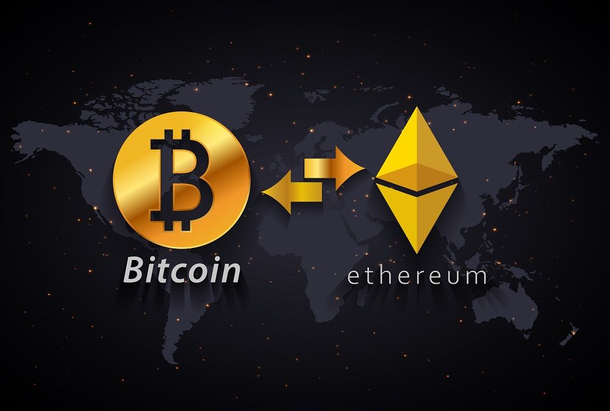

# <div align="center">Etherium tracking script 📈</div>

<div align="center">

</div>

<br/>

I made this django project to explore new technologies and libraries, as well as hone my docker containerization skill.
In this project, I have collected the most popular and necessary tools for creating complex and full-fledged projects.

## Description

<div align="center">

</div>

<br/>

This is one of the most complex Django projects that I have implemented to date. I created an online store where you can
log in through social networks or register, receive email confirmation letters, purchase various products, sort them by
categories, and then pay through the Stripe system. You can also see a list of all your orders and their status. This is
a fully functional and ready-to-use online store.

Since I position myself as a backend developer, I focused on the internal components, not the appearance of the
site.

## Technologies

***Languages***


***Libraries***


The main technologies used in the project are data caching with Redis, asynchronous email confirmation sending (I also
implemented the sending mechanism myself), social media authentication through django-allauth. The most time-consuming
task was connecting to Stripe. In addition to writing a controller that handles payments, I also had to configure
webhook operation. I also integrated Stripe products and the django admin panel so that when a new product is added, the
data is also updated in Stripe. It was not easy to package all of this into a Docker container, ensure the seamless
operation of each service, and automate the deployment of the web application in Docker.

## Project setup

***Via virtual environment***

1. Create and activate a python virtual environment
2. In the terminal, enter the following command:

```
pip3 install -r requirements.txt
```

3. Create a .env file and paste the data from the .env.example file into it
4. Log in to Binance, go to this page and create a new API key.
5. Copy the API Key and Secret Key, paste their values into the BINANCE_API_KEY and BINANCE_SECRET_KEY variables.
6. Run the file main.py

## <div align="center">Thank you for using my script! 👋</div>